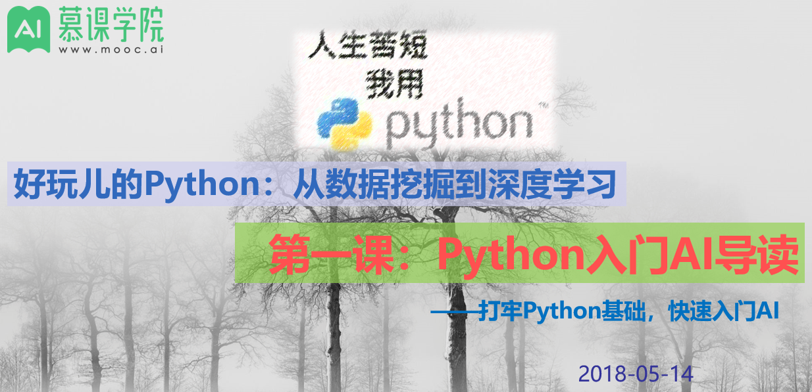

# [Python-learning](https://wqw547243068.github.io/Python-learning/)

**好玩儿的Python：从数据挖掘到深度学习**
- 详情请点击：[慕课学院](http://www.mooc.ai/course/489)

## Git代码库
- 克隆代码库到本地:
> git clone git@github.com:wqw547243068/Python-learning.git

## 课程列表
- 【2019-5-3】[Python从新手到大师-100天](https://github.com/jackfrued/Python-100-Days)
### 时间线

|*时间*|*章节*|*题目*|*作业*|*备注*|
|----|----|:------:|:----|:----|
|2018-5-14|第一节|导读|||
|2018-5-21|第二节|Python基础|请完成ppt里提到的5-6个作业|这节课长达2h，内容非常多|
|2018-5-28|第三节|文本处理||字符串+面向对象+文本处理|
|2018-6-6|第四节|数据分析基础||Python生态圈及数据分析|
|||||||

### 内容提要

#### 第一节 入门导读
内容如下：
1. AI时代何去何从
   - 时代浪潮：移动互联网→O2O→大数据→互金→智能家居→共享→AI→区块链
   - DL是AI/ML的一个重要分支，Data是燃料（DM能力不可或缺）
1. 如何高效学习
   - 知乎：[为什么大多数人宁愿吃生活的苦，也不愿吃学习的苦？](https://www.zhihu.com/question/272483562/answer/376542013)（主动吃苦）
   - 学习金字塔: 主动学习＞被动学习,教授＞总结＞实践＞看书
   - 费曼技巧：[终极快速学习方法](https://www.zhihu.com/question/20576786)
   - 怎么成为大牛？走出舒适区，进入学习区
   - 大脑的学习之道：图谱结构+注意力+联想记忆+推理反思
1. 课程导读

#### 第二节 Python基础
内容如下：
1. 入门神图：
   - 包，程序入口，函数，循环，分支，编码
1. 开发环境：
   - 三大流派：IDE+命令行+web
   - Linux开发环境是互联网标配
   - 大神简介：[Linus，一生只为寻找欢笑](https://zhuanlan.zhihu.com/p/19796979)
   - [入门级：GitHub和Git超超超详细使用教程](https://blog.csdn.net/javaandroid730/article/details/53522872)
   - [Git简易指南](http://www.bootcss.com/p/git-guide/), [Git快速入门](http://www.cnblogs.com/polk6/p/git-introduce.html)，[猴子都能懂的git入门](http://backlogtool.com/git-guide/cn/)，[Git常用命令速查表](https://files.jb51.net/file_images/article/201409/git_big_jb51.jpg)
   - 官方环境[Jupyter Lab](http://jupyter.org/try)、[Google Colab](http://g.co/colab)（含GPU要翻墙）、 [Kaggle](https://www.kaggle.com/kernels)
   - [7个Jupyter Notebook小提示与技巧](https://www.jianshu.com/p/dacc6acba00b), [Jupyter notebook快速入门](https://www.cnblogs.com/nxld/p/6566380.html),[Jupyter nbviewer](http://nbviewer.jupyter.org/)：各种notebook资料分享
1. hello world
   - [如何高效的调试](https://www.zhihu.com/question/21572891), [pdb单步调试技巧](https://www.cnblogs.com/rwxwsblog/p/4605309.html)
   - 代码规范：[Google规范](https://zh-google-styleguide.readthedocs.io/en/latest/google-python-styleguide/python_style_rules/),[Pylint：默认PEP8规范](https://www.ibm.com/developerworks/cn/linux/l-cn-pylint/)
1. 数据结构
   - [数据结构总结](http://lib.csdn.net/article/datastructure/11369)
1. 算法
   - [数据结构算法可视化网站visualgo](https://visualgo.net/en),[图解排序算法](http://www.cnblogs.com/chengxiao/p/6129630.html)
   - [递归，分治算法，动态规划和贪心选择的区别](http://www.cnblogs.com/codeskiller/p/6477181.html)
1. 总结

#### 第三节 Python基础（续）
内容如下：
1. Python之禅：设计哲学
1. 词频统计：词频排序→Top 3→中文版→文件读写→新闻语料
1. 面向对象：代码块→函数→模块（过程） →类→包
   - 面向对象：[初级篇](http://www.cnblogs.com/wupeiqi/p/4493506.html)，[进阶篇](http://www.cnblogs.com/wupeiqi/p/4766801.html)
1. 总结

#### 第四节 Python数据分析基础
1. 数据基础
   - 线性代数（35%）
      - 资料：[「Deep Learning」读书系列分享第二章：线性代数-分享总结](https://www.leiphone.com/news/201708/iL1S8jkc4ytZFzHS.html) 【文字版】, [线性代数笔记](https://note.youdao.com/share/?id=2dd5b67042a5a49bd81a450c0a7490be&type=note#/)
   - 概率与信息论（25%）
      - 资料：[「Deep Learning」读书系列分享第三章：概率和信息论-分享总结](https://www.leiphone.com/news/201708/lbN7eWYBcovwhhN7.html)，【文字版】
      - 其他资料：[Deep Learning解读合辑-国庆特辑](https://mp.weixin.qq.com/s?__biz=MjM5ODU3OTIyOA==&mid=503183187&idx=1&sn=cf18a77ef1249b589c89e23e0ddcae9e&chksm=3ec1ca2009b64336d14cacc57a4dadd6f732af61cf29b6517df7c1387d5eedcd00837dab88e3&mpshare=1&scene=23&srcid=0605oj6B3P1HddCiBJgOolQE#rd), 视频版
1. Python生态圈
   - numpy, 矩阵运算工具，资料如下：
      - [70个NumPy分级练习：用Python一举搞定机器学习矩阵运算](https://www.toutiao.com/a6527910077834199566/?tt_from=mobile_qq&utm_campaign=client_share&timestamp=1525573097&app=news_article&utm_source=mobile_qq&iid=31862217871&utm_medium=toutiao_android)
      - [用python做科学计算——Numpy快速处理数据](http://old.sebug.net/paper/books/scipydoc/numpy_intro.html)
      - [python numpy笔记](https://www.zybuluo.com/chanvee/note/89078)
      - [知识点总结：脑图笔记](https://woaielf.github.io/2017/04/15/numpy/)
   - pandas，表格数据分析工具，资料如下：
      - [Pandas学习笔记-常用功能](https://zhuanlan.zhihu.com/p/25013519)
      - [十分钟搞定pandas](http://www.cnblogs.com/chaosimple/p/4153083.html)
      - [知识点总结：脑图笔记](https://woaielf.github.io/2017/04/22/Pandas/)
   - matplotlib,画图工具，资料如下：
      - [matplotlib官方教程](http://matplotlib.org/1.3.1/users/pyplot_tutorial.html)
      - [matplotlib核心剖析](http://www.cnblogs.com/vamei/archive/2013/01/30/2879700.html)
      - [知识点总结：脑图笔记](https://woaielf.github.io/2017/04/27/matplotlib/)
1. 数据分析
分析流程如下：

   - 朝阳医院数据分析，分析过程参考：[销售数据分析](https://zhuanlan.zhihu.com/p/29210673),[用numpy和pandas分析数据过程](https://zhuanlan.zhihu.com/p/33437294)
   - kaggle数据分析，数据源参考：[各领域公开数据集](https://zhuanlan.zhihu.com/p/25138563)
1. 总结

#### 第五节 机器学习基础
1. 什么是机器学习
   - 各种关系
1. 基本概念
   - 流程,[Google机器学习速成课程](https://developers.google.cn/machine-learning/crash-course/training-and-test-sets/video-lecture),[使用sklearn做单机特征工程](https://www.cnblogs.com/jasonfreak/p/5448385.html),[用正则化(Regularization)来解决过拟合](https://www.cnblogs.com/ooon/p/4964441.html)
   - 专业术语
   - 典型问题
1. 经典算法
   - [图解机器学习](https://my.oschina.net/taogang/blog/1544709),[动态图体验网址](https://codepen.io/collection/DPWwaj/2/)
   - [图解机器学习](C:\Users\wqw\Desktop\tantan\fastai\好玩儿的python\ppt\图解机器学习), web形式展示机器学习的前后过程
1. 案例
   - [Scikit-learn官网](http://scikit-learn.org/stable/),[中文文档](http://sklearn.apachecn.org/cn/0.19.0/)
   - [Sklearn快速使用及经典算法实现](https://www.cnblogs.com/lianyingteng/p/7811126.html)
1. 总结

#### 第六节 深度学习基础
1. 什么是深度学习
   - 定义+发展历史
1. 神经网络
   - 基本流程
   - 反向传播
   - 梯度下降
   - 资料：[可视化神经网络空间变换](http://cs.stanford.edu/people/karpathy/convnetjs/demo/classify2d.html),[Google playground](http://playground.tensorflow.org/#activation=sigmoid&batchSize=10&dataset=circle&regDataset=reg-gauss&learningRate=0.03&regularizationRate=0.001&noise=0&networkShape=4,3,4,2&seed=0.57107&showTestData=false&discretize=false&percTrainData=50&x=true&)
   - [Yes you should understand backprop](https://medium.com/@karpathy/yes-you-should-understand-backprop-e2f06eab496b)
1. Tensorflow
   - [小白都能懂的tensorflow教程](http://www.sohu.com/a/126825423_465975)
1. Tensorboard
   - [详解TensorBoard如何调参](https://blog.csdn.net/qunnie_yi/article/details/80129434)
1. 总结

#### 第七节 iris和mnist
1. iris数据集+机器学习实战, [有道笔记链接](http://note.youdao.com/noteshare?id=d056f57ae605874c8485ae50eddc8d66&sub=D81038A5C91E4BE6A612ACEB8A56AEDE)
1. mnist数据集+tensorflow进阶，[jupyter notebook地址](./courses/chapter_7/scikit-learn-example.ipynb)

#### 第八节 RNN和NLP
1. RNN简介
   - 资料：[循环神经网络（RNN）原理通俗解释](https://blog.csdn.net/qq_39422642/article/details/78676567),[TensorFlow中RNN实现的正确打开方式](https://blog.csdn.net/starzhou/article/details/77848156)
   - [理解LSTM网络](https://www.jianshu.com/p/9dc9f41f0b29),[英文原文](https://colah.github.io/posts/2015-08-Understanding-LSTMs/)
1. 应用：
   - 分类：再谈MNIST,[RNN用于MNIST分类](https://cuiqingcai.com/4934.html)
   - 回归：股票预测, [LSTM股票预测](https://blog.csdn.net/mylove0414/article/details/55805974)
1. NLP简介
   - NLP基本概念
      - [NLP学习总结](https://www.jianshu.com/p/ee484fd1c6d8),[十分钟NLP概述](https://www.cnblogs.com/baiboy/p/learnnlp.html),[BosonNLP在线示例](https://bosonnlp.com/demo#overview-emotion)

1. 应用
   - 聊天机器人
      - [python分析微信朋友圈](https://blog.csdn.net/u012485099/article/details/79522144),[Python解密微信大数据](https://zhuanlan.zhihu.com/p/33230381),[Itchat微信自动回复](https://zhuanlan.zhihu.com/p/34238048)
   - seq2seq,[charRNN-TF](https://github.com/hzy46/Char-RNN-TensorFlow)
1. 总结
   - 资料,[语音机器人](https://www.thepaper.cn/newsDetail_forward_2238654),[艾诚中英文切换超自如 对话网红机器人获赞](http://ent.enorth.com.cn/system/2017/09/14/033729404.shtml)

#### 第九节 CNN和CV
1. iris数据集+机器学习实战
1. CNN简介
   - 计算机视觉
      - [YJango的卷积神经网络——介绍](https://zhuanlan.zhihu.com/p/27642620),[SIFT与HOG特征提取](http://blog.csdn.net/taigw/article/details/42206311)
      - [李飞飞《让冰冷的机器读懂照片背后的故事》](http://www.ifanr.com/648667),[TED视频《我们怎样教计算机理解图片》](https://www.ted.com/talks/fei_fei_li_how_we_re_teaching_computers_to_understand_pictures?language=zh-cn),[网易公开课：《李飞飞：如何教计算机理解图片》](http://open.163.com/movie/2015/3/Q/R/MAKN9A24M_MAKN9QAQR.html)
   - CNN基本结构
      - 《神经网络与深度学习》吴岸城,[Deep Learning（深度学习）学习笔记整理系列之（一）](http://blog.csdn.net/zouxy09/article/details/8775360),[Andrew Ng 深度学习(Deep Learning)介绍](http://blog.sina.com.cn/s/blog_50a5cf290101r7a6.html)
      - [YJango的卷积神经网络——介绍](https://zhuanlan.zhihu.com/p/27642620),[卷积神经网络工作原理直观的解释？](https://www.zhihu.com/question/39022858)
      - [Yann LeCun连发三弹：人人都懂的深度学习基本原理（附视频）](https://www.leiphone.com/news/201612/Sjkmer9Kto5ILxFk.html?utm_source=itdadao&utm_medium=referral)
      - [卷积神经网络中用1*1 卷积有什么作用或者好处呢？](https://www.zhihu.com/question/56024942)
      - 手写数字识别[3D交互体验](http://scs.ryerson.ca/~aharley/vis/conv/)
      - [CNN发展历史](http://www.cnblogs.com/52machinelearning/p/5821591.html),[台大李宏毅：一天搞懂深度学习](http://v.youku.com/v_show/id_XMTY5NDUzNjIxNg==.html?from=s1.8-1-1.2&spm=0.0.0.0.LZsB12%EF%BC%8C%E4%B8%80%E5%A4%A9%E6%90%9E%E6%87%82%E6%B7%B1%E5%BA%A6%E5%AD%B8%E7%BF%92--%E5%AD%B8%E7%BF%92%E5%BF%83%E5%BE%97)

1. 应用
   - 目标检测,作业：[Tensorflow lite在移动设备上的运行Demo](https://blog.csdn.net/masa_fish/article/details/54097796)
   - 人脸识别,作业：[python的人脸识别工具包face recognition](https://github.com/ageitgey/face_recognition)
   - 参考资料：[Large Pose 3D Face Reconstruction from a Single Image via Direct Volumetric CNN Regression](http://aaronsplace.co.uk/papers/jackson2017recon/),[2D图像三维重建Demo体验地址](http://www.cs.nott.ac.uk/~psxasj/3dme/view.php?name=../59b415560b915),[表情替换，DeepWarp Demo Page](http://163.172.78.19/)
   - 颜值预测，[一个基于 TensorFlow 的「颜值评分」开源项目：FaceRank](https://zhuanlan.zhihu.com/p/28208481)
1. 反思
   - [Geoffrey Hinton多伦多大学演讲：卷积神经网络的问题](http://www.sohu.com/a/165989490_465975)
   - [Hinton的Capsule论文全公开！首发《胶囊间的动态路由》原文精译，了解Hinton的胶囊网络ㅣ第一部分：直觉](http://mp.weixin.qq.com/s/gAFKrUjfQyqaDKNyMRitZg)

## 数据挖掘实战
### big bang可视化分析
- 用python分析big bang台词，并可视化，[jupyter笔记](https://github.com/wqw547243068/Python-learning/blob/master/courses/chapter_3/big_bang_theory.ipynb)
- 
- [TelAntiNomy](https://blog.csdn.net/Tele_Anti_Nomy/article/details/88092709)
- 
- 【2019-05-22】汇总top场景的top人物的词频[heatmap](courses/chapter_3/heatmap_freq.html)
- <iframe src="courses/chapter_3/heatmap_freq.html" scrolling="yes" border="0" frameborder="no" framespacing="0" allowfullscreen="true"  height="400" width="600"> </iframe>
- 台词汇总[vis_summary](courses/chapter_3/vis_summary.html)
- <iframe src="courses/chapter_3/vis_summary.html" scrolling="yes" border="0" frameborder="no" framespacing="0" allowfullscreen="true"  height="1500" width="100%"> </iframe>
- top场景top人物的词云汇总[vis_summary](courses/chapter_3/vis_summary.html)
- <iframe src="courses/chapter_3/vis_wordcloud.html" scrolling="yes" border="0" frameborder="no" framespacing="0" allowfullscreen="true"  height="600" width="100%"> </iframe>
- pyecharts的词云demo：
- <iframe src="courses/chapter_3/wordcloud.html" scrolling="yes" border="0" frameborder="no" framespacing="0" allowfullscreen="true"  height="600" width="100%"> </iframe>
- [markdown转html格式工具](https://dillinger.io/)

### 华为讲话稿分析
- 【2019-05-25】[独立页面](https://wqw547243068.github.io/Python-learning/data_mining/huawei)
- <iframe src="data_mining/huawei.html" scrolling="yes" border="0" frameborder="no" framespacing="0" allowfullscreen="true"  height="600" width="100%"> </iframe>

### 轨迹点聚类分析
- 【2019-05-28】用DBSCAN将定位点聚类成簇，再做分类预测，判断常驻点，[示例](https://wqw547243068.github.io/Python-learning/data_mining/cluster.html)
- <iframe src="data_mining/cluster.html" scrolling="yes" border="0" frameborder="no" framespacing="0" allowfullscreen="true"  height="600" width="100%"> </iframe>

## 交流分享
欢迎大家入群分享、交流！

---
<iframe style="margin-left: 2px; margin-bottom:-5px;" frameborder="0" scrolling="0" width="100px" height="20px"
   src="https://ghbtns.com/github-btn.html?user=wqw547243068&repo=Python-learning&type=star&count=true" >
</iframe>
---

---
<!-- Global site tag (gtag.js) - Google Analytics -->

---
